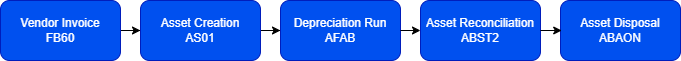

# SAP FI Asset Accounting Case Study

## Overview

This project demonstrates the lifecycle of fixed assets in SAP FI-AA.

It includes documentation of key SAP transactions used by asset accountants.

## SAP Transactions Covered

AS01 – Asset creation
FB60 – Vendor invoice posting
AFAB – Depreciation run
ABST2 – Asset reconciliation
ABAON – Asset retirement

## Project Structure

business-case – company scenario
transactions – SAP accounting processes
data – asset register dataset
analytics – reporting and dashboards

## Skills Demonstrated

SAP FI Asset Accounting
Accounting process documentation
ERP process understanding

## Asset Dataset

The project includes a simulated fixed asset register similar to a SAP FI-AA export.

The dataset contains asset information such as:

* asset category
* purchase cost
* depreciation
* net book value
* cost center allocation

The dataset can be used for financial analysis and reporting.

## Asset Analytics Dashboard

A Power BI dashboard is included in this project to visualize asset accounting data.

The dashboard provides insights into:

* total asset value
* depreciation expenses
* asset distribution by category
* investment trends
* cost center allocation

This demonstrates how SAP financial data can be transformed into business intelligence reports.

